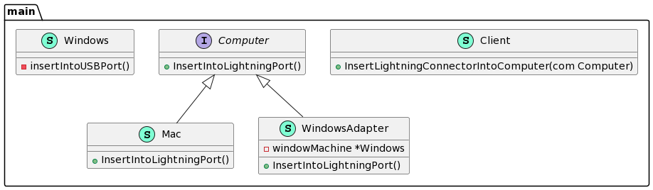

# Adapter Design Pattern

***

[Adapter in Go](https://refactoring.guru/design-patterns/adapter/go/example)

Adapter is a structural design pattern, which allows **incompatible objects** to collaborate.

The Adapter acts as a **wrapper** between two objects. It catches calls for one object and transforms them to format and interface recognizable by the second object.

***

