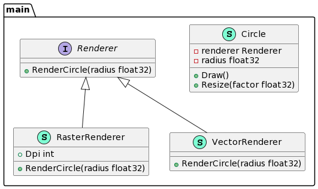

# Bridge Design Pattern 

One of these hierarchies (often called the Abstraction) will get a reference to an object of the second hierarchy (Implementation). The abstraction will be able to delegate some (sometimes, most) of its calls to the implementations object. Since all implementations will have a common interface, they’d be interchangeable inside the abstraction.

* Decouple abstraction from implementation 

* Both can exist as hierarchies

* A stronger from of encapsulation

***

```go
package main

import "fmt"

type Renderer interface {
        RenderCircle(radius float32)
}

type VectorRenderer struct {
}

func (v *VectorRenderer) RenderCircle(radius float32) {
        fmt.Println("Drawing a circle of radius", radius)
}

type RasterRenderer struct {
        Dpi int
}

func (r *RasterRenderer) RenderCircle(radius float32) {
        fmt.Println("Drawing pixels for circle of radius", radius)
}

type Circle struct {
        renderer Renderer
        radius   float32
}

func (c *Circle) Draw() {
        c.renderer.RenderCircle(c.radius)
}

func NewCircle(renderer Renderer, radius float32) *Circle {
        return &Circle{renderer: renderer, radius: radius}
}

func (c *Circle) Resize(factor float32) {
        c.radius *= factor
}

func main() {
        // raster := RasterRenderer{}
        vector := VectorRenderer{}
        circle := NewCircle(&vector, 5)
        circle.Draw()
}
```
***



***

[Bridge in Go](https://refactoring.guru/design-patterns/bridge/go/example#:~:text=Bridge%20is%20a%20structural%20design,the%20second%20hierarchy%20(Implementation).)

Bridge is a structural design pattern that divides business logic or huge class into separate class hierarchies that can be developed independently.

One of these hierarchies (often called the Abstraction) will get a reference to an object of the second hierarchy (Implementation). The abstraction will be able to delegate some (sometimes, most) of its calls to the implementations object. Since all implementations will have a common interface, they’d be interchangeable inside the abstraction.


